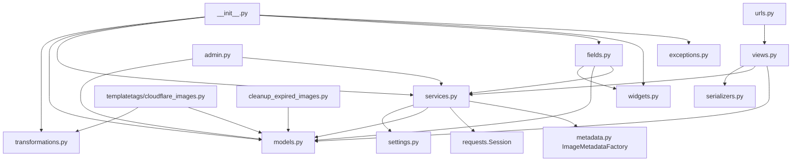
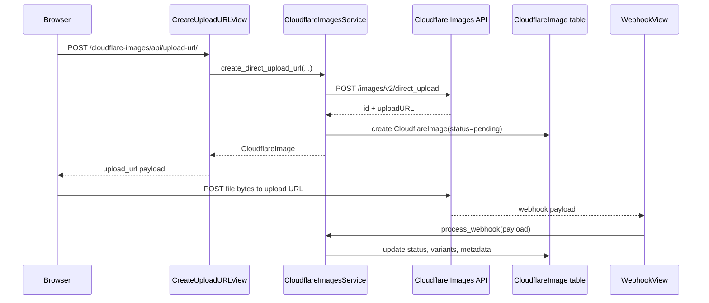

The package is a Django app with two Django-independent islands: `django_cloudflareimages_toolkit/transformations.py` and the `ImageMetadataFactory` base in `django_cloudflareimages_toolkit/metadata.py`. Everything else layers on top of Django settings, models, or DRF. The top-level package file, `django_cloudflareimages_toolkit/__init__.py`, keeps those layers separate by eagerly exporting transformation helpers and lazily importing Django-dependent objects only when you access them.

## Module Relationships

The service layer in `django_cloudflareimages_toolkit/services.py` is the operational center. It reads configuration through the `cloudflare_settings` singleton from `django_cloudflareimages_toolkit/settings.py`, talks to Cloudflare over HTTP, creates or updates `CloudflareImage` and `ImageUploadLog` rows from `django_cloudflareimages_toolkit/models.py`, and exposes a module-level singleton named `cloudflare_service`.

The DRF layer in `django_cloudflareimages_toolkit/views.py` is intentionally thin. `CreateUploadURLView` validates request payloads with `ImageUploadRequestSerializer`, calls `cloudflare_service.create_direct_upload_url`, and returns a normalized response via `ImageUploadResponseSerializer`. `CloudflareImageViewSet` mostly works with the local `CloudflareImage` table and only calls back into the service for status refresh and Cloudflare deletion. `WebhookView` is the boundary where Cloudflare calls the app instead of the app calling Cloudflare.

The rendering side is separate. `CloudflareImageTransform`, `CloudflareImageVariants`, and `CloudflareImageUtils` in `django_cloudflareimages_toolkit/transformations.py` build URLs and responsive attributes without database access. `django_cloudflareimages_toolkit/templatetags/cloudflare_images.py` is mostly a thin wrapper around those utilities plus a few database lookups such as `cf_image_info`.

## Request and Data Lifecycle

The lifecycle starts with a server-issued one-time upload URL. The service resolves metadata and creator (see below), clamps `expiry_minutes` into the Cloudflare-supported `2..360` minute range, serializes `metadata` to JSON, and sends a multipart request because Cloudflare expects form fields rather than a JSON body. Once the response comes back, the package persists a `CloudflareImage` row immediately so there is something local to update later.

Later synchronization can happen in three ways. `check_image_status` in `services.py` polls the Cloudflare `images/v1/{id}` endpoint and then calls `CloudflareImage.update_from_cloudflare_response`. The webhook path does the same update, but from push events received by `WebhookView`. The explicit `register_uploaded_image` path (reached through `CloudflareImage.objects.register_uploaded`) fetches the image with `get_image`, refuses anything missing (`ImageNotFoundError`) or still in draft (`ImageNotReadyError`), then `get_or_create`s the local row and applies the same update. All three flows also create `ImageUploadLog` rows so the admin surface can show a local event trail.

### Metadata factory extension point

Metadata resolution is an explicit extension point. The service reads `DEFAULT_METADATA`, `DEFAULT_CREATOR`, and `METADATA_FACTORY` from the `cloudflare_settings` singleton. It merges `DEFAULT_METADATA` under the per-request `metadata` (per-request keys win), then, if `METADATA_FACTORY` is configured, resolves it via Django's `import_string` and calls it with the merged metadata plus context (`user`, `custom_id`, `creator`). The factory's return value has the final say. The base `ImageMetadataFactory` in `django_cloudflareimages_toolkit/metadata.py` is a callable class whose `get_metadata` you override; it stays Django-independent so it can be unit-tested in isolation. The resolved metadata and creator are sent to Cloudflare and stored on the `CloudflareImage` row.

## Key Design Decisions

### Lazy top-level imports

`django_cloudflareimages_toolkit/__init__.py` exports transformation helpers directly and resolves Django-dependent symbols through `__getattr__`. That choice prevents import-time failures before Django settings are configured. The tests in `tests/test_imports.py` explicitly lock in this behavior by asserting that the service can be instantiated before required settings are accessed.

### Dynamic settings reads instead of caching

`CloudflareImagesSettings` in `django_cloudflareimages_toolkit/settings.py` reads from `django.conf.settings` on every property access. The tests in `tests/test_imports.py` depend on `override_settings` changing values immediately. The trade-off is small repeated dictionary lookups, but the benefit is correct behavior in tests and multi-environment setups.

### Thread-local HTTP sessions

The service keeps `requests.Session` inside `threading.local()` rather than on the class itself. That prevents cookie jars, adapters, or other mutable session internals from leaking between concurrent requests. Because auth headers are generated per request with `_auth_headers()`, token changes are also visible immediately.

### Local persistence around a remote API

The package does not treat Cloudflare as the only source of truth. `CloudflareImage` stores status, expiry, dimensions, variants, and arbitrary metadata locally, and `ImageUploadLog` stores lifecycle events. That makes user-scoped listings, admin inspection, and cleanup possible without depending on Cloudflare for every page load.

### Thin wrappers over transformation URLs

The transformation layer deliberately stays string-based. `CloudflareImageTransform` only validates and assembles options; it does not make API calls. That keeps it usable in scripts, templates, and even pre-Django contexts. The predefined helpers in `CloudflareImageVariants` are just convenience compositions of the builder, not a separate configuration system.

## How the Pieces Fit Together

If you use the package end to end, the normal path is:

1. Configure `CLOUDFLARE_IMAGES` and include `django_cloudflareimages_toolkit.urls`.
2. Call `CreateUploadURLView` or `cloudflare_service.create_direct_upload_url`.
3. Upload the file directly to Cloudflare with the returned one-time URL.
4. Let either `WebhookView` or `check_image_status` drive the local row into `uploaded`.
5. Render delivery URLs from `CloudflareImage` properties, `CloudflareImageFieldValue`, or the transformation utilities.
6. Inspect and manage rows from Django admin or clean up stale uploads with the management command.

That split is consistent throughout the codebase: transport logic in the service, persisted state in models, integration boundaries in views and tags, and URL generation in the transformation helpers.
