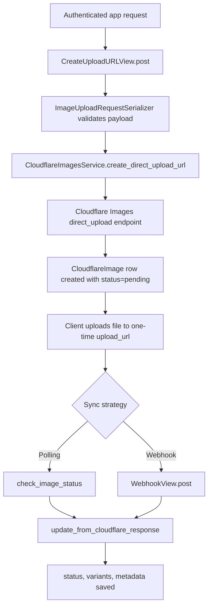

The direct upload lifecycle is the core abstraction of the package. It exists so your Django server can mint a short-lived Cloudflare upload URL without ever exposing your Cloudflare API token to the browser. The server keeps a local `CloudflareImage` record while the browser sends bytes straight to Cloudflare.

This concept connects the service layer in `django_cloudflareimages_toolkit/services.py`, the tracked model in `django_cloudflareimages_toolkit/models.py`, and the API/webhook endpoints in `django_cloudflareimages_toolkit/views.py`. If you understand this lifecycle, every other feature in the package becomes easier to reason about.



## Why It Exists

Without this pattern, a Django app usually ends up doing one of two bad things: proxying file uploads through the app server or leaking privileged Cloudflare credentials to the client. The toolkit implements the recommended third option. The browser gets a single-use upload URL, and your server keeps just enough state to authorize, observe, and recover the workflow.

Internally, `CloudflareImagesService.create_direct_upload_url` clamps the expiry value to Cloudflare's supported range, serializes metadata to JSON, and posts multipart form fields to `/accounts/{account_id}/images/v2/direct_upload`. The returned result is immediately persisted as a `CloudflareImage` row with `status=pending`, `upload_url`, `expires_at`, and an `ImageUploadLog` row that records the event.

## How It Relates to Other Concepts

- It depends on the settings model because `account_id`, `api_token`, and defaults come from `CloudflareImagesSettings`.
- It updates tracked image state through `CloudflareImage.update_from_cloudflare_response`.
- It feeds the transformation concept because an uploaded image only becomes useful once `variants` exist and delivery URLs can be rendered.
- It is the workflow that `CloudflareImageFieldValue` and the template tags assume has already happened.

## How It Works Internally

`CreateUploadURLView.post` in `views.py` is the canonical HTTP entry point. It validates request data with `ImageUploadRequestSerializer`, calls `cloudflare_service.create_direct_upload_url`, optionally persists the original filename, and returns `id`, `cloudflare_id`, `upload_url`, `expires_at`, and `status`.

Synchronization happens in two separate code paths:

- `CloudflareImagesService.check_image_status(image)` calls the Cloudflare `images/v1/{image.cloudflare_id}` endpoint, then calls `image.update_from_cloudflare_response(result)`.
- `WebhookView.post` validates the signature when `WEBHOOK_SECRET` is configured, parses JSON, validates it with `WebhookPayloadSerializer`, then calls `cloudflare_service.process_webhook(payload)`, which also delegates to `update_from_cloudflare_response`.

This shared `update_from_cloudflare_response` method in `models.py` is important. It is where `uploaded_at`, `status`, `variants`, `cloudflare_metadata`, `width`, `height`, and `format` are actually merged into the database record.

## Basic Usage

```python
from django_cloudflareimages_toolkit.services import cloudflare_service

image = cloudflare_service.create_direct_upload_url(
    user=request.user,
    metadata={"kind": "avatar", "user_id": str(request.user.pk)},
    require_signed_urls=False,
    expiry_minutes=15,
)

return JsonResponse(
    {
        "cloudflare_id": image.cloudflare_id,
        "upload_url": image.upload_url,
        "expires_at": image.expires_at.isoformat(),
    }
)
```

## Advanced Usage

This pattern uploads a local file from the Django server, then forces a sync. It is useful for imports, CMS jobs, or background tasks.

```python
import requests

from django_cloudflareimages_toolkit.exceptions import CloudflareImagesError
from django_cloudflareimages_toolkit.services import cloudflare_service


def upload_from_disk(path: str, * user=None) -> str:
    image = cloudflare_service.create_direct_upload_url(
        user=user,
        metadata={"source": "backfill"},
        expiry_minutes=30,
    )

    with open(path, "rb") as fh:
        response = requests.post(
            image.upload_url,
            files={"file": (image.cloudflare_id, fh, "application/octet-stream")},
            timeout=60,
        )

    if not response.ok:
        raise CloudflareImagesError(
            f"Upload failed: {response.status_code} {response.text[:200]}"
        )

    cloudflare_service.check_image_status(image)
    image.refresh_from_db()
    return image.public_url or ""
```

<Callout type="warn">Treat `upload_url` as a single-use secret. The service stores it locally for lifecycle tracking, but you should not log it, cache it broadly, or reuse it for multiple files. Also note that `get_signed_url()` currently falls back to the regular URL because real Cloudflare signed URL generation is not implemented in the model or field wrapper yet.</Callout>

<Accordions>
<Accordion title="Webhook-first vs polling-only">
Webhook processing is the better fit when you want the local database to converge quickly without a user-triggered refresh. `WebhookView` accepts either `X-Signature` or `X-Cloudflare-Signature`, validates the body with HMAC-SHA256 when `WEBHOOK_SECRET` is configured, and returns clean 400 or 401 responses for malformed or unsigned traffic. Polling with `check_image_status()` is still useful for batch jobs and admin actions because it is explicit and easy to schedule, but it turns status convergence into an extra call path you have to remember to run. A pragmatic production setup uses webhooks for normal completion and polling as a repair or reconciliation tool.

```python
cloudflare_service.check_image_status(image)
```
</Accordion>
<Accordion title="Issuing upload URLs in the request path vs a background job">
Most applications should issue direct upload URLs inline because `create_direct_upload_url()` is lightweight and gives the client everything it needs immediately. The method only makes one Cloudflare API call and then writes one `CloudflareImage` row and one log row locally. Moving that step into a background job usually adds queue latency to an interaction that the browser needs synchronously. The better place for a queue is the follow-up work after upload, such as image moderation, metadata enrichment, or post-processing in your own app.

```python
image = cloudflare_service.create_direct_upload_url(user=request.user)
```
</Accordion>
<Accordion title="Relying on Cloudflare state alone vs persisting local rows">
It is possible to treat Cloudflare as the only state store and save just the image ID in your own models, but this package intentionally does more than that. The `CloudflareImage` table gives you user-scoped listings, expiry cleanup, admin inspection, upload logs, and an object that webhooks can update without additional lookup glue. The downside is a second state store that can drift if you never poll or receive webhooks. In practice that trade-off is worth it because the operational visibility gained from `CloudflareImage` and `ImageUploadLog` is exactly what most teams end up rebuilding anyway.

```python
print(image.status, image.expires_at, image.variants)
```
</Accordion>
</Accordions>
