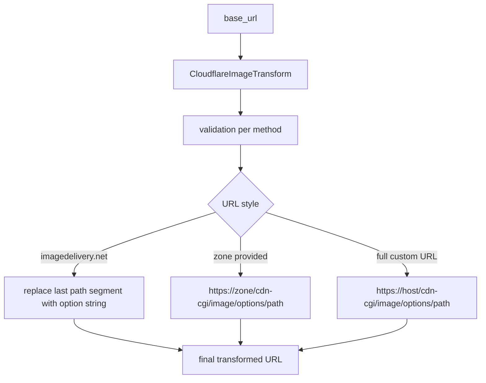

The transformation layer is the most reusable part of the package because it does not depend on Django models or settings. It gives you a fluent builder for Cloudflare delivery URLs, a small set of predefined variant helpers, and utility methods for `srcset`, `sizes`, and URL validation. The code lives entirely in `django_cloudflareimages_toolkit/transformations.py`.

This concept matters because upload state and delivery state are different problems. A `CloudflareImage` tells you whether an image is available; the transformation builder tells you how to deliver it efficiently.



## What It Is

`CloudflareImageTransform` is a fluent builder with methods such as `width`, `height`, `fit`, `gravity`, `quality`, `format`, `dpr`, `sharpen`, `blur`, `brightness`, `contrast`, `gamma`, `rotate`, `trim`, `background`, `border`, `pad`, and `crop`. Each method validates its inputs and stores a stringable value in `self.transforms`. `build()` then joins those options into the correct Cloudflare URL shape.

`CloudflareImageVariants` is a convenience layer over that builder. Methods such as `thumbnail`, `avatar`, `hero_image`, `responsive_image`, `product_image`, `gallery_image`, and `mobile_optimized` are just named compositions of the fluent API.

`CloudflareImageUtils` adds static helpers for extracting image IDs, checking whether a URL is a Cloudflare delivery URL, generating a `srcset`, generating a `sizes` attribute, and validating URL structure.

## How It Relates to Other Concepts

- `CloudflareImage.public_url` and `thumbnail_url` often become the `base_url` input for new transformations.
- The template tag layer is mostly a thin wrapper around `CloudflareImageVariants` and `CloudflareImageUtils`.
- The package root eagerly re-exports these classes so they can be imported even before Django is configured.

## How It Works Internally

`build()` detects the URL style in three branches:

1. If `base_url` contains `imagedelivery.net`, it assumes Cloudflare Images delivery and replaces the final path segment with the comma-separated option string.
2. If `zone` was provided, it builds `https://{zone}/cdn-cgi/image/{options}/{image_path}` for Cloudflare Image Resizing on your own domain.
3. Otherwise, it either injects `/cdn-cgi/image/` into a full URL or prefixes a relative path with `/cdn-cgi/image/{options}/...`.

That branching is why the transformation layer is so valuable: the calling code does not need to remember two delivery systems and three URL assembly cases.

## Basic Usage

```python
from django_cloudflareimages_toolkit import CloudflareImageTransform

url = (
    CloudflareImageTransform(
        "https://imagedelivery.net/account-hash/demo-image/public"
    )
    .width(640)
    .height(360)
    .fit("cover")
    .gravity("auto")
    .format("auto")
    .quality(85)
    .build()
)
```

## Advanced Usage

This example uses the Image Resizing path for a custom domain instead of the `imagedelivery.net` format:

```python
from django_cloudflareimages_toolkit.transformations import (
    CloudflareImageTransform,
    CloudflareImageUtils,
)

hero_url = (
    CloudflareImageTransform("/media/uploads/banner.jpg" zone="example.com")
    .width(1600)
    .height(900)
    .fit("contain")
    .background("#ffffff")
    .pad("20,40,20,40")
    .build()
)

srcset = CloudflareImageUtils.get_srcset(
    "https://imagedelivery.net/account-hash/demo-image/public",
    [320, 640, 1024],
    quality=80,
)
```

<Callout type="warn">When the input URL is an `imagedelivery.net` URL, `build()` replaces the last path segment. If you pass a URL whose final segment is already a custom variant name, the builder will discard that variant name in favor of the option string. That is correct for flexible variants, but it surprises people who expect the builder to append options instead of replacing the trailing segment.</Callout>

<Accordions>
<Accordion title="Builder methods vs predefined variants">
The fluent builder is more expressive because it exposes the full option surface and strict input validation. The predefined helpers in `CloudflareImageVariants` are faster to read and keep template code short, but they encode opinionated defaults such as `quality(85)` or `format("webp")` for mobile. In teams, the sweet spot is often to standardize on the predefined helpers for common UI patterns and drop to the builder only for exceptions. That keeps most code consistent while preserving an escape hatch for unusual art direction or performance tuning.

```python
CloudflareImageVariants.thumbnail(base_url, 150)
```
</Accordion>
<Accordion title="Cloudflare Images delivery vs Cloudflare Image Resizing">
The builder supports both URL families because real deployments often use both. Cloudflare Images delivery is the natural fit when the image already lives in Cloudflare Images and you have a stable `imagedelivery.net` URL. Image Resizing is useful when you serve media on your own hostname or need `/cdn-cgi/image/` semantics. The trade-off is mental overhead: the same builder behaves slightly differently depending on the input URL and the optional `zone` parameter, so code reviews should make that branch obvious.

```python
CloudflareImageTransform("/images/photo.jpg" zone="example.com").width(300).build()
```
</Accordion>
<Accordion title="Runtime URL building vs persisting precomputed variants">
Runtime building keeps delivery decisions close to the call site and avoids storing a long list of derivative URLs in your own database. That is a good fit for responsive layouts, `srcset`, and one-off transformations where the dimensions are request-dependent. Persisting or standardizing variants is easier to cache and reason about when the same sizes are reused everywhere, which is why the package includes named helpers such as `thumbnail` and `hero_image`. In practice you can mix both: persist the Cloudflare image identity, then build exact delivery URLs lazily when rendering.

```python
CloudflareImageUtils.get_sizes_attribute({"max-width: 768px": 100, "default": 800})
```
</Accordion>
</Accordions>
