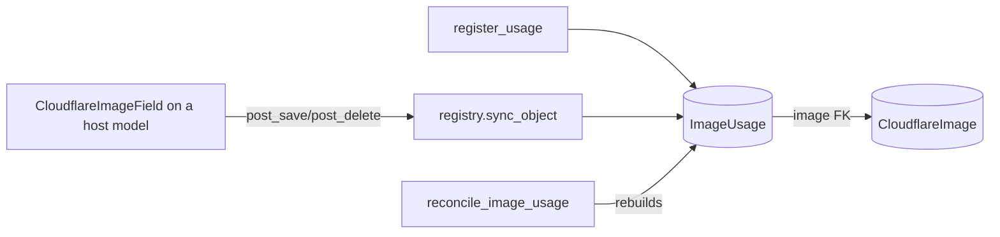

`CloudflareImage` and `ImageUploadLog` answer *what has been uploaded*. The image
usage registry answers the other half that admins and site staff need: *which
content is actually using each image*. Together they form a single source of truth
for both questions.

This concept is implemented in `django_cloudflareimages_toolkit/registry.py`,
`signals.py`, and the `ImageUsage` model in `models.py`, and is surfaced through
the admin, the DRF API, and the `reconcile_image_usage` command.

## The problem

A `CloudflareImageField` stores only a bare `cloudflare_id` string on its host
model (for example `Product.image` or `Profile.avatar`). Nothing records the
reverse link, so without the registry there is no way to ask "which content
references this image?", no way to spot orphaned uploads (referenced by nothing),
and deletes are unsafe because an image still in use can be removed.

## The solution

The registry has two layers:

1. A **field registry** — `get_models_with_image_fields()` auto-discovers every
   `CloudflareImageField` declared across installed apps. It is derived from the
   model definitions themselves, so it never drifts from the code.
2. A materialised **`ImageUsage`** index — one row per `(content object, field)`
   reference, kept in sync automatically. It is a *derived* index, not an
   independent source of truth: it can always be rebuilt from the host models.



## Automatic tracking

When the app starts, `CloudflareImagesConfig.ready()` connects `post_save` and
`post_delete` receivers to each discovered host model (and only those models).
Saving keeps the matching `ImageUsage` row current; clearing the field removes it;
deleting the object removes all of its rows.

```python
from django_cloudflareimages_toolkit.fields import CloudflareImageField

class Product(models.Model):
    image = CloudflareImageField(blank=True, null=True)

product = Product.objects.create(image="cloudflare-image-id")
# Saving the model fires the post_save receiver, which creates/updates an
# ImageUsage row linking "cloudflare-image-id" to this product — no extra code.
```

## Manual API

For references the toolkit cannot discover automatically — an ID kept in a JSON
blob, fetched from another service, or derived at runtime — record them
explicitly. Both calls are idempotent.

```python
from django_cloudflareimages_toolkit import register_usage, unregister_usage

register_usage(obj, "cloudflare-image-id")            # field_name="manual" by default
register_usage(obj, "other-id", field_name="hero")    # distinguish multiple refs
unregister_usage(obj)
```

Manual rows are tagged with `source="manual"` on `ImageUsage` and reconcile
preserves them regardless of `field_name`.

> **The `field_name` must not match a `CloudflareImageField` on the model.**
> Usage rows are unique on `(content_type, object_id, field_name)`, so a manual
> label that collides with a tracked field name would share the *same row* as
> the auto-tracked reference — the two would overwrite each other. `register_usage`
> raises `ValueError` if you pass a colliding label. Use a distinct label (the
> default `"manual"` is always safe).

> **Upgrading a dev build that already used `register_usage` with a custom
> label.** The `source` marker only exists from this release on, so reconcile
> can't tell a pre-existing custom-label manual row apart from an auto row for a
> renamed/removed field. Re-run your `register_usage(...)` calls once after
> upgrading to stamp `source="manual"` on those rows. (Rows using the default
> `"manual"` label are always protected; released versions have no pre-existing
> rows because the registry ships whole in one release.)

## Reverse lookups

```python
image.usages.all()                                    # what references this image
CloudflareImage.objects.filter(usages__isnull=True)   # orphaned (unused) images
ImageUsage.objects.filter(image__isnull=True)         # referenced but unregistered
```

An **unregistered reference** is content that points at a `cloudflare_id` for
which no `CloudflareImage` record exists yet. When such an image is later saved,
`post_save` backfills the link automatically.

## Keeping it accurate

Signals cover ordinary `save()` / `delete()` calls. Bulk operations
(`QuerySet.update()`, `bulk_create`, `loaddata`, raw SQL) bypass signals, so run
the reconcile command to rebuild from the host models. It is deterministic and
idempotent — running it repeatedly converges to the same state.

```bash
python manage.py reconcile_image_usage            # rebuild + report orphans/unregistered
python manage.py reconcile_image_usage --dry-run  # report only, no writes
```

Run it once after first deploying this version to backfill existing references
(the migration creates the table but does not scan host models).

## Where it shows up

- **Admin** — a thumbnail [gallery view](./api-reference/admin-and-widget) with
  status/orphan/usage badges, a "Used by" panel, and Orphaned/Unregistered
  filters.
- **REST API** — `/images/{id}/usages/`, `/images/orphans/`, `/usages/`,
  `by-cloudflare-id` lookup, and usage-aware deletes
  (see [Views and Routes](./api-reference/views-and-routes)).
- **Cleanup** — `cleanup_expired_images --delete-orphans` removes long-unused
  images from Cloudflare and the database. Retention is based on
  `CloudflareImage.last_referenced_at` (bumped each time the registry records a
  reference), not on upload time — an image that was used for years and only
  recently became unused is protected by `--orphan-days`.
