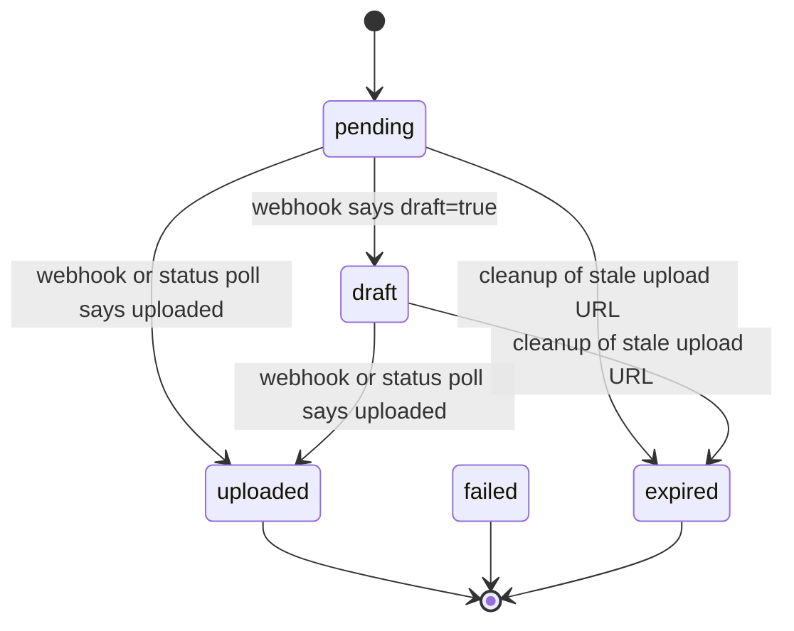

The package does not stop at generating upload URLs. It persists a local record of every issued upload in `CloudflareImage` and a stream of lifecycle events in `ImageUploadLog`. That model layer is the reason the package can expose user-scoped APIs, admin inspection, expiry cleanup, and field wrappers that can recover delivery URLs from only a stored Cloudflare ID.

This concept is implemented in `django_cloudflareimages_toolkit/models.py` and is consumed by the service layer, DRF viewset, admin, field wrapper, and management command. It is the local source of truth for your application even though the underlying media is stored remotely on Cloudflare.



## What the Model Solves

Cloudflare alone knows whether an image upload exists, but your Django application cares about more context than that. It needs to know which user initiated the upload, which file name or metadata was associated with it, whether the upload window is still valid, which transformed URLs are available, and what happened when a webhook or polling attempt ran. `CloudflareImage` solves that application-level tracking problem.

## Relationship to Other Concepts

- The direct upload lifecycle creates and updates `CloudflareImage` rows.
- `CloudflareImageFieldValue` in `fields.py` optionally looks up a `CloudflareImage` row to provide richer accessors such as `file_size`, `variants`, and `metadata`.
- The transformation helpers consume the `public_url` or `thumbnail_url` properties that the model exposes.
- The cleanup command and admin actions both operate on status and expiry data stored in this model.

## How It Works Internally

`ImageUploadStatus` is a `TextChoices` enum with `pending`, `draft`, `uploaded`, `failed`, and `expired`. `CloudflareImage.status` uses those choices, and the service layer only writes legitimate values through model methods or queryset updates.

The most important logic lives in four model methods and properties:

- `get_variant_url(variant_name: str) -> str | None` inspects the `variants` JSON field. It supports both the current list-of-URLs form and a defensive dict lookup if Cloudflare ever returns a mapped variant structure.
- `public_url` and `thumbnail_url` are convenience properties that call `get_variant_url("public")` and `get_variant_url("thumbnail")`.
- `is_ready` is stricter than `is_uploaded`; it requires both `status == uploaded` and a truthy `variants` list.
- `update_from_cloudflare_response(response_data: dict[str, Any]) -> None` applies uploaded flags, draft flags, variants, metadata, width, height, and format, then saves the model.

`ImageUploadLog` is intentionally minimal: `event_type`, `message`, JSON `data`, and `timestamp`. The service writes logs when it creates upload URLs, checks status, deletes images, and processes webhooks. Admin then renders those rows inline for incident-style debugging.

## Basic Usage

```python
from django_cloudflareimages_toolkit.models import CloudflareImage

image = CloudflareImage.objects.get(cloudflare_id="cf-image-123")

print(image.status)
print(image.is_uploaded)
print(image.public_url)
print(image.get_url("thumbnail"))
```

## Advanced Usage

This query matches the filtering logic used by `CloudflareImageViewSet.get_queryset()` and is a good starting point for dashboards or periodic maintenance jobs.

```python
from django.utils import timezone

from django_cloudflareimages_toolkit.models import CloudflareImage, ImageUploadStatus

recent_ready_images = (
    CloudflareImage.objects.filter(
        user=request.user,
        status=ImageUploadStatus.UPLOADED,
        uploaded_at__gte=timezone.now() - timezone.timedelta(days=7),
        require_signed_urls=True,
    )
    .exclude(variants=[])
    .order_by("-created_at")
)
```

<Callout type="warn">Do not assume `status == uploaded` guarantees a usable delivery URL. The model exposes `is_ready` because a row can become uploaded before the `variants` list is populated or refreshed locally. If you render immediately after upload, prefer `is_ready` or guard against `public_url is None`.</Callout>

<Accordions>
<Accordion title="Storing only Cloudflare IDs vs storing full lifecycle data">
If all you need is a delivery URL, a plain `CharField` with a Cloudflare image ID can work. This package goes further because operational workflows need more than that: expiry, user ownership, logs, and webhook-driven mutation all need somewhere local to live. The extra table does introduce one more thing to migrate and monitor, but it eliminates ad hoc glue code in views, admin actions, and cleanup scripts. The model is the reason a package-level service can feel integrated instead of stateless.

```python
image.get_variant_url("public")
```
</Accordion>
<Accordion title="Trusting the cached row vs re-syncing with Cloudflare">
Reading from `CloudflareImage` is fast and keeps request paths local, especially for listings and templates. The trade-off is that the row can lag behind Cloudflare if a webhook failed or a background sync never ran. The package addresses that with `check_image_status()` for explicit repair and with `WebhookView` for push-based updates, but it does not automatically refresh on every property access because that would turn template rendering into remote API traffic. Choose freshness deliberately: local reads for normal pages, explicit sync for admin or background reconciliation.

```python
cloudflare_service.check_image_status(image)
```
</Accordion>
<Accordion title="Using the field wrapper vs querying CloudflareImage directly">
`CloudflareImageFieldValue` is ergonomic when a model only stores the Cloudflare ID and you want URL helpers near that field. Direct model queries are better when you need filtering, joins, or log inspection because `CloudflareImageFieldValue` intentionally stays lightweight. The wrapper caches a single lookup lazily and swallows database errors to avoid breaking model access during partial setup, which is convenient but less explicit than querying `CloudflareImage` yourself. Use the wrapper for per-instance ergonomics and the model for anything list-oriented or operational.

```python
product.image.get_metadata()
```
</Accordion>
</Accordions>
